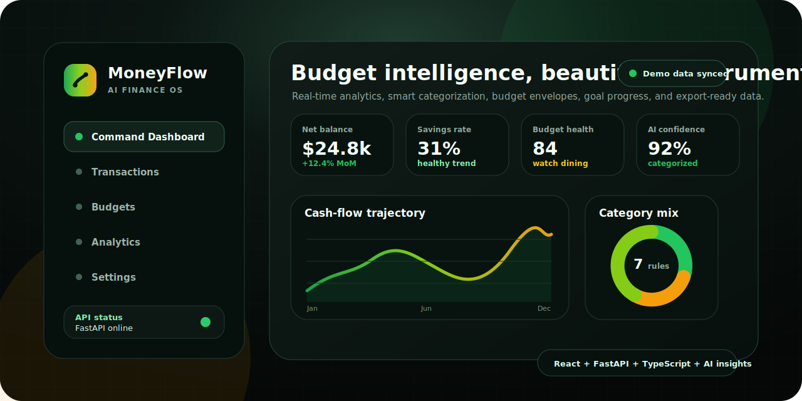

<p align="center">
  <a href="https://github.com/Alexi5000/MoneyFlow#readme">
    
  </a>
</p>

<p align="center">
  <strong>MoneyFlow is an AI-powered budget command center with a cursor.com-inspired dark interface, smart categorization, real-time analytics, budget envelopes, savings goals, and a complete React plus FastAPI platform foundation.</strong>
</p>

<p align="center">
  <a href="./docs/README.md"><strong>Documentation</strong></a>
  ·
  <a href="./docs/backend.md"><strong>API Reference</strong></a>
  ·
  <a href="./docs/STATE_OF_THE_ART_BUILDOUT_PLAN.md"><strong>Architecture</strong></a>
  ·
  <a href="./docs/CREDITS.md"><strong>Credits</strong></a>
  ·
  <a href="https://github.com/Alexi5000/MoneyFlow/issues"><strong>Issues</strong></a>
</p>

<p align="center">
  <a href="https://github.com/Alexi5000/MoneyFlow"></a>
  <a href="./src/frontend/App.tsx"></a>
  <a href="./src/backend/main.py"></a>
  <a href="./package.json"></a>
  <a href="./docs/CREDITS.md"></a>
</p>

---

## Why MoneyFlow

MoneyFlow turns personal finance into a **high-signal operating system** instead of another spreadsheet. The platform combines a polished dark dashboard, deterministic seeded demo data, a typed FastAPI contract, and a React experience that remains explorable even when the backend is offline. The repository is built as a product foundation: the current implementation is local-first and demo-ready, while the architecture leaves a clear path toward persistent storage, authentication, bank-sync providers, and production deployment.

The README has been redesigned to follow the same above-the-fold conventions used by strong open-source landing pages: a visual project banner, meaningful badges, immediate documentation links, quick-start commands, API tables, and clear attribution boundaries. Public README pattern research was guided by the curated `awesome-readme` collection and `Best-README-Template`, both of which emphasize screenshots, badges, concise summaries, quick links, installation guidance, roadmap context, and credits as hallmarks of useful project front pages.[1] [2]

| Product Layer | What Is Implemented |
|---|---|
| **Frontend cockpit** | A React 18 and TypeScript dashboard with cursor-style dark surfaces, responsive navigation, KPI cards, charts, budgets, goals, settings, and demo fallback state. |
| **Backend platform** | A FastAPI service with health checks, typed Pydantic models, seeded finance data, transaction CRUD, analytics, categorization, budgets, goals, rules, and export payloads. |
| **Finance intelligence** | AI-style insight cards, rule-driven category suggestions, confidence scoring, recurring-spend signals, cash-flow summaries, savings-rate metrics, and budget-health analysis. |
| **Documentation system** | A root landing page, backend reference, buildout architecture, final status, deployment notes, and license-safe inspiration credits. |
| **Validation posture** | A reusable backend contract script, production frontend build checks, documentation reference scans, and repository hygiene checks. |

---

## Product Preview

The graphic above is a repository-local SVG preview of the MoneyFlow design language. It is intentionally stored at [`docs/assets/moneyflow-readme-hero.svg`](./docs/assets/moneyflow-readme-hero.svg) so the README remains visually rich without depending on a third-party screenshot host.

| Experience | Detail |
|---|---|
| **Command Dashboard** | Net balance, income, expense, savings-rate, budget-health, and AI-confidence cards give a quick executive summary. |
| **Analytics Canvas** | Cash-flow trend charts, category distribution, recurring-spend analysis, and insight prioritization turn raw transactions into decisions. |
| **Budget Studio** | Category envelopes show utilization, remaining funds, status labels, and practical warnings when a category is at risk. |
| **Goals Workspace** | Savings goals track current progress, targets, date metadata, and next-step recommendations. |
| **Transaction Intelligence** | Transaction rows include merchant details, category metadata, recurring markers, search and filters, and creation/deletion flows. |
| **Settings and Export** | The app exposes API connectivity, refresh behavior, configuration hints, and export readiness for future integrations. |

---

## Built With

MoneyFlow deliberately keeps the stack familiar, inspectable, and easy to run locally. The frontend and backend are separated cleanly, but the contracts are aligned so the repository can evolve into a hosted platform without a rewrite.

| Area | Technology |
|---|---|
| **Interface** | React 18, TypeScript, Vite, Tailwind CSS, Framer Motion, Recharts, and Lucide icons. |
| **API** | Python, FastAPI, Pydantic, Uvicorn, and CORS middleware. |
| **Data model** | In-memory seeded finance records with typed transaction, budget, goal, rule, analytics, and export models. |
| **Validation** | `scripts/validate_backend_contract.py`, `npm run build`, route checks, documentation scans, and whitespace hygiene. |
| **Package workflow** | `npm` is the validated frontend package-manager path for this repository buildout. |

---

## Quick Start

The fastest way to evaluate MoneyFlow is to run the FastAPI backend and Vite frontend in two terminals. The frontend reads `VITE_MONEYFLOW_API_URL` when present and otherwise points to the local backend default.

| Requirement | Recommended Version |
|---|---|
| **Node.js** | 18 or newer. |
| **Python** | 3.10 or newer. |
| **npm** | Current stable npm bundled with Node.js. |

```bash
# Clone the repository
git clone https://github.com/Alexi5000/MoneyFlow.git
cd MoneyFlow

# Install the frontend dependencies
npm install

# Install the backend dependencies
python -m pip install -r src/backend/requirements.txt
```

Start the backend first:

```bash
uvicorn src.backend.main:app --reload --host 127.0.0.1 --port 8000
```

Then start the frontend:

```bash
npm run dev
```

Open the Vite URL shown in the terminal. If the API is not reachable, the frontend falls back to embedded demo data so the visual experience remains testable.

---

## API Surface

The backend lives in [`src/backend/main.py`](./src/backend/main.py). It is intentionally self-contained for review and local evaluation, while still using typed route handlers and response models.

| Method | Endpoint | Purpose |
|---|---|---|
| `GET` | `/health` | Returns service health, version metadata, and seeded-record counts. |
| `GET` | `/api/v1/dashboard` | Returns the analytics summary, monthly trend, category spend, cash-flow forecast, recurring candidates, and insight payloads. |
| `GET` | `/api/v1/transactions` | Lists transactions with optional query, category, type, and recurring filters. |
| `POST` | `/api/v1/transactions` | Creates a transaction and applies categorization metadata. |
| `DELETE` | `/api/v1/transactions/{transaction_id}` | Deletes a transaction by identifier. |
| `GET` | `/api/v1/budgets` | Lists budget envelopes with spend, remaining amount, utilization, and status. |
| `GET` | `/api/v1/goals` | Lists savings goals with target amounts, current amounts, progress, and dates. |
| `GET` | `/api/v1/rules` | Lists merchant and keyword categorization rules. |
| `POST` | `/api/v1/categorize` | Predicts a category, confidence level, and rationale for transaction-like input. |
| `GET` | `/api/v1/export` | Returns a JSON export payload containing transactions, budgets, goals, rules, and generation metadata. |

---

## Validation

MoneyFlow includes repeatable validation commands so future changes can be checked without relying on ad hoc manual inspection.

```bash
# Backend contract validation
python scripts/validate_backend_contract.py

# Frontend production build
npm run build
```

| Validation Area | Expected Result |
|---|---|
| **Backend import** | `src.backend.main` imports successfully and exposes the expected FastAPI route contract. |
| **Dashboard contract** | Dashboard analytics include summaries, trends, categories, forecast, recurring candidates, and insights. |
| **Transaction CRUD** | Listing, creation, categorization metadata, and deletion paths are exercised by the validation script. |
| **Frontend build** | Vite produces a production bundle from the active React and TypeScript entry points. |
| **Docs and hygiene** | Documentation references are checked, generated dependency folders are ignored, and trailing whitespace is normalized. |

---

## Repository Map

| Path | Purpose |
|---|---|
| [`src/frontend/App.tsx`](./src/frontend/App.tsx) | Main React application, routes, dashboard views, API client, and demo fallback data. |
| [`src/frontend/main.tsx`](./src/frontend/main.tsx) | Frontend entry point. |
| [`src/frontend/index.css`](./src/frontend/index.css) | Tailwind and global styling entry. |
| [`src/backend/main.py`](./src/backend/main.py) | FastAPI app, models, seeded data, route handlers, analytics, and categorization logic. |
| [`scripts/validate_backend_contract.py`](./scripts/validate_backend_contract.py) | Reusable backend contract validation script. |
| [`docs/backend.md`](./docs/backend.md) | Backend reference and route behavior documentation. |
| [`docs/STATE_OF_THE_ART_BUILDOUT_PLAN.md`](./docs/STATE_OF_THE_ART_BUILDOUT_PLAN.md) | Architecture and implementation plan for the current platform buildout. |
| [`docs/CREDITS.md`](./docs/CREDITS.md) | Open-source inspiration, authorship, and license-boundary notes. |
| [`docs/assets/moneyflow-readme-hero.svg`](./docs/assets/moneyflow-readme-hero.svg) | Branded README hero graphic. |

---

## Open-Source Inspiration and License Boundaries

MoneyFlow was designed after reviewing leading open-source personal-finance and dashboard projects, including Firefly III, Actual Budget, Maybe Finance, and a modern React finance dashboard. Those projects informed product-level ideas such as budget envelopes, local-first finance workflows, polished dashboards, and clear documentation, but this repository does **not** vendor their code. The implementation in this repository is written for MoneyFlow and keeps inspiration credits separate from direct contribution claims.[3] [4] [5] [6]

| Inspiration Source | What MoneyFlow Learned | Boundary |
|---|---|---|
| **Firefly III** | Rich personal-finance domain coverage and serious self-hosted budgeting conventions.[3] | Inspiration only; no source code copied. |
| **Actual Budget** | Local-first budgeting, envelope-style thinking, and practical finance workflows.[4] | Inspiration only; no source code copied. |
| **Maybe Finance** | Modern personal-finance product feel and strong dashboard positioning.[5] | Inspiration only; no source code copied. |
| **React finance dashboard examples** | Dashboard layout ideas, KPI-first presentation, and chart-heavy finance interfaces.[6] | Inspiration only; no source code copied. |

> **Attribution note:** External projects listed above are credited as inspiration sources. They are not represented as direct contributors to MoneyFlow unless they have contributed directly to this repository through GitHub history.

---

## Roadmap

MoneyFlow is now a strong full-stack foundation. The next production-oriented stage should replace the seeded in-memory data with durable services and explicit user boundaries.

| Stage | Focus |
|---|---|
| **Persistence** | Add a real database layer, migrations, seed scripts, and environment-based configuration. |
| **Authentication** | Add user accounts, session management, protected routes, and per-user finance records. |
| **Bank connectivity** | Integrate a provider such as Plaid or a CSV import pipeline for real transaction ingestion. |
| **AI services** | Replace deterministic categorization with provider-backed enrichment, explainability, and human approval flows. |
| **Deployment** | Add production Docker or platform-specific deployment instructions with environment validation. |
| **Testing** | Expand unit, integration, accessibility, and end-to-end coverage across frontend and backend flows. |

---

## Contributing

Contributions should preserve the repository’s attribution boundaries, avoid introducing license-incompatible source code, and keep the frontend and backend contracts synchronized. A good pull request should include a concise description, screenshots or API examples when applicable, and validation evidence from the backend contract script and frontend production build.

```bash
git checkout -b feature/your-moneyflow-improvement
python scripts/validate_backend_contract.py
npm run build
```

---

## License

MoneyFlow is released under the MIT License. See [LICENSE](./LICENSE) for details. Third-party projects referenced in this README retain their own licenses, authorship, and contribution histories.

<p align="center">
  <strong>Built by <a href="https://github.com/Alexi5000">Alex Cinovoj</a> · TechTide AI</strong>
</p>

<p align="center">
  <em>Take control of your money with a modern AI finance cockpit.</em>
</p>

---

## References

[1]: https://github.com/matiassingers/awesome-readme "awesome-readme: curated README examples"
[2]: https://github.com/othneildrew/Best-README-Template "Best-README-Template"
[3]: https://github.com/firefly-iii/firefly-iii "Firefly III"
[4]: https://github.com/actualbudget/actual "Actual Budget"
[5]: https://github.com/maybe-finance/maybe "Maybe Finance"
[6]: https://github.com/iambhavesh55/personal-finance-dashboard "Personal Finance Dashboard"
